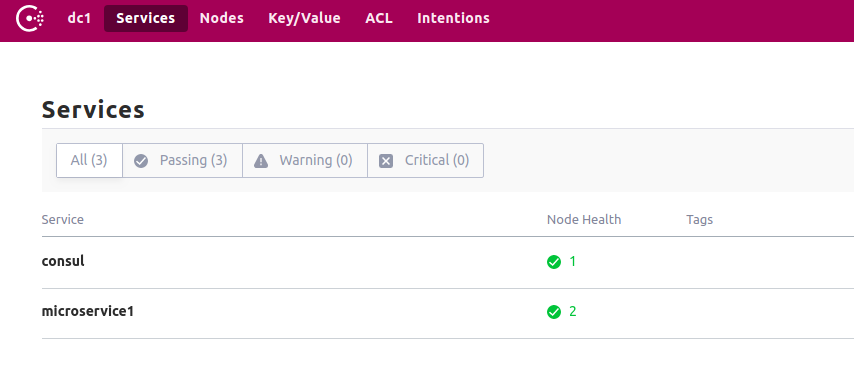

I know that Microservices are a big buzz word now, but after working with the so called monoliths, i have to say that MS (as we will refer them from now on, i'm sorry Microsoft fanboys :smile:) are really helpful in terms of separation of concerns.
A team can be working on a mailing service, and another on a billing service, as long as they all collaborate and speak the same "language" everything is going to be ok.

But MS brings other problems to the table such as connectivity and debugging.


## Connectivity


As MS allows us to balance load between multiple instances of the same service, how does one (another service) knows how to communicate with it, and to which one?.
Tools like [Consul](https://www.consul.io/) are here to help us with this issue, one of its uses (and the one we're discussing here) is **Service Discovery**.


## Install Consul

We will use Docker since it's the easiest way, just run `docker run -p 8500:8500 --name consul -d consul`


## Create a Microservice with Micronaut


First you need to install Micronaut, the easy way is through https://sdkman.io/ . After you install `sdkman` run `sdk install micronaut`.

To create a project run `mn create-app microservice1`.


#### Enable consul registration

Open up your `build.grade` file and insert `compile "io.micronaut:discovery-client"` inside the `dependencies` block.

Add the following configuration to your `application.yaml`

```yaml
consul:
  client:
    registration:
      enabled: true
    defaultZone: "${CONSUL_HOST:localhost}:${CONSUL_PORT:8500}"
```

Now run your app with `./gradlew run` and enter `http://localhost:8500`. You should see your first Micronaut App registered by Consul.

